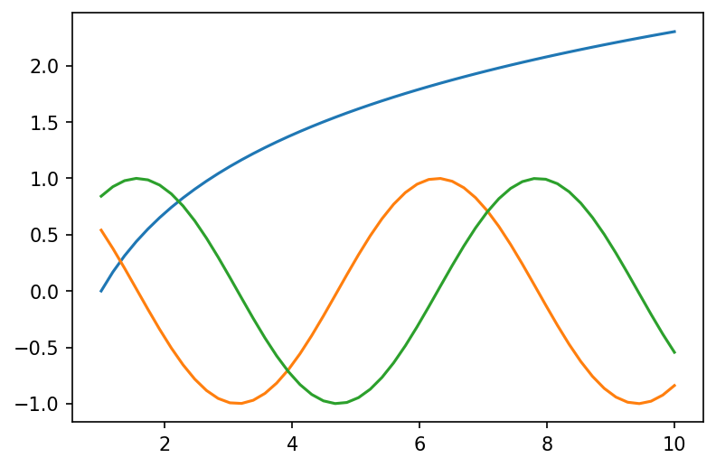
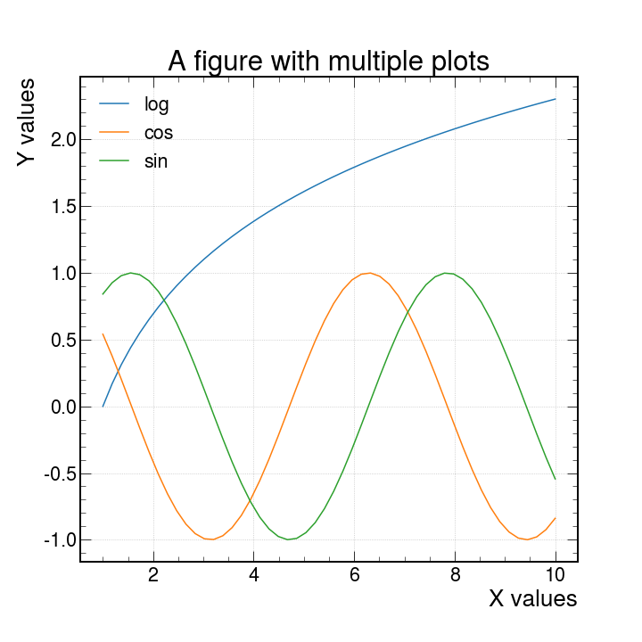
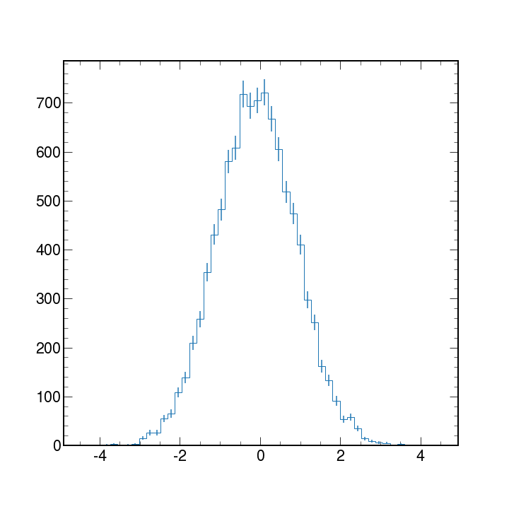

The example-based nature of [Matplotlib documentation](https://matplotlib.org/) is GREAT.

Matplotlib is the standard when it comes to making plots in Python. It is versatile and allows for lots of functionality and different ways to produce many plots.
We will be focusing on using matplotlib for High Energy Physics.

# A simple example

As with any Python code it is always good practice to import the necessary libraries as a first step.

```python
import matplotlib.pyplot as plt
```

Matplotlib graphs your data on Figures (i.e., windows, Jupyter widgets, etc.), each of which can contain one or more Axes (i.e., an area where points can be specified in terms of x-y coordinates, or theta-r in a polar plot, or x-y-z in a 3D plot, etc.). The simplest way of creating a figure with an Axes object is using `pyplot.subplots`. We can then use `Axes.plot` to draw some data on the axes:

```python
fig, ax = plt.subplots()  # Create a figure containing a single axes.
ax.plot([1, 2, 3, 4], [1, 4, 2, 3])  # Plot some data on the axes.
plt.show() # Show the figure
```

This code produces the following figure:

<!--  -->


> ## Notice
> If you look at the plot and the order of the list of numbers you can clearly see that the order of the arguments is of the form
>
> ~~~
> ax.plot(xpoints,ypoints)
> ~~~
> {: .language-python}
>
>But what is useful is that if we wanted to do more than one plot in the same figure we could do this in two main ways.
> ~~~
> ax.plot(xpoints,ypoints , xpoints_2,ypoints_2, xpoints_3,ypoints_3)
> ~~~
> {: .language-python}
Or the more traditional way
> ```python
> ax.plot(xpoints,ypoints)
> ax.plot(xpoints_2,ypoints_2)
> ax.plot(xpoints_3,ypoints_3)
> ```
> Both methods allow you to produce a plot like the following *(we will later see how to produce them in more detail)*
> > ## See example plot
> >
> > 
> {: .solution}
{: .callout}

# What goes into a plot?

Now, let's have a deeper look at the components of a Matplotlib figure.


## How to work with some of these elements?

> ## Note
> We will be making the plot shown in the **Notice** above as an example and develop on top of it for each element we will be showing.
This will be done gradually such to only need to add the lines shown in the code.
{: .callout}

For the following example you will need these lines as a starting point.

```python
import matplotlib.pyplot as plt
import numpy as np
#generate data points
x1 = np.linspace(1,10)
y1,y2,y3 = np.log(x1),np.cos(x1),np.sin(x1)

#plotting
plt.plot(x1,y1)
plt.plot(x1,y2)
plt.plot(x1,y3)
plt.show()
```

### Axes Labels

In order to produce axes labels in matplotlib one uses the self descriptive command `xlabel` or `ylabel` like so

```python
plt.xlabel("X values")
plt.ylabel("Y values")
```

One can also control the location, orientation and size of the text by adding the keyword arguments `size = 15, orientation = 45`

An important detail is that when you want to do changes and show them in your plot you must apply these changes between the `plt.plot` and `plt.show()` commands.
Why? These commands act on the canvas that is currently being drawn, so it should make sense that one has to first create the canvas with the plot with `plt.plot()` and apply changes afterwards.
When you are done with it, only then you may use the `plt.show()` as this will dump to the screen all changes applied. Any command used after `plt.show()` will return an error since matplotlib does not know what is the canvas to be worked on.

### Legend

There are different ways to create a legend in matplotlib but the easiest one to use would be to pass the keyword argument `label` inside the `plt.plot()` and use the `plt.legend()` command to automatically detect and show the individual labels on the canvas

```python
plt.plot(x1,y1,label="log")
plt.plot(x1,y2,label="cos")
plt.plot(x1,y3,label="sin")

plt.legend()
```

### The Figure (resize and set the resolution)

As mentioned, by default `plt.plot` creates the canvas automatically. We can have finer control over the shape and quality of the plots by using the `plt.figure` command using the keyword arguments `figsize` and `dpi` as follows.

```python
plt.figure(figsize = (10,10), dpi = 150)
```

This has to be set **before** any instance of `plt.plot` and it sets the width and height to 10 and 10 inches respectively. The keyword `dpi` refers to a density of *Dots Per Inch*.
There is no particular reason to choose 150 as the value for dpi but there is a visually a noticeable difference in the size and quality of the plot.

### Title

The title of a plot is placed at the top of the figure with the command `plt.title`

```python
plt.title("A figure with multiple lines")
```

We can control the font size of the labels, the title and any text by passing the `fontsize` argument and giving any integer. This will determine the size in points.

### Grid

Now lets add a grid with `plt.grid`. This is self explanatory.

```python
plt.grid()
```

Another nice thing is that we can add the `alpha` argument to make the lines of the grid more or less "see through". This can also be done lines, dots, shades, and almost anything else that has color.

### Ticks

By default python will drop some ticks on the y and x axis but we can have control over them with the  arguments

- `ticks` : When this argument is specified with an array-like object, you can control the location of the ticks to show. For example :

```python
plt.yticks(ticks=[1,2,5,6,7])
```

Will only show the numbers `[1,2,5,6,7]` in their proper location.

- `labels` : This can only be used if `ticks` is also specified. This will be the physical text shown on each of the locations specified by `ticks`. For example:

```python
plt.yticks(ticks=[1,2,5,6,7],labels = ["One",2,"Five","Then sixth","The Last"])
```

Will show each of the specified labels in the locations as specified by `ticks`

- `size`: This argument accepts integer values to controls the fontsize of the tick labels.

## Linestyles and markers

The basic `plt.plot` uses lines by default, but we can specify what to use as a marker or the linestyle for each line. Here is a table with the different options available

| character |      description      | character |     description     | character |  color  |
|:---------:|:---------------------:|:---------:|:-------------------:|:---------:|:-------:|
| '.'       | point marker          | '-'       | solid line style    | 'b'       | blue    |
| ','       | pixel marker          | '--'      | dashed line style   | 'g'       | green   |
| 'o'       | circle marker         | '-.'      | dash-dot line style | 'r'       | red     |
| 'v'       | triangle_down marker  | ':'       | dotted line style   | 'c'       | cyan    |
| '^'       | triangle_up marker    |           |                     | 'm'       | magenta |
| '<'       | triangle_left marker  |           |                     | 'y'       | yellow  |
| '>'       | triangle_right marker |           |                     | 'k'       | black   |
| '1'       | tri_down marker       |           |                     | 'w'       | white   |
| '2'       | tri_up marker         |           |                     |           |         |
| '3'       | tri_left marker       |           |                     |           |         |
| '4'       | tri_right marker      |           |                     |           |         |
| '8'       | octagon marker        |           |                     |           |         |
| 's'       | square marker         |           |                     |           |         |
| 'p'       | pentagon marker       |           |                     |           |         |
| 'P'       | plus (filled) marker  |           |                     |           |         |
| '*'       | star marker           |           |                     |           |         |
| 'h'       | hexagon1 marker       |           |                     |           |         |
| 'H'       | hexagon2 marker       |           |                     |           |         |
| '+'       | plus marker           |           |                     |           |         |
| 'x'       | x marker              |           |                     |           |         |
| 'X'       | x (filled) marker     |           |                     |           |         |
| 'D'       | diamond marker        |           |                     |           |         |
| 'd'       | thin_diamond marker   |           |                     |           |         |
| '\|'      | vline marker          |           |                     |           |         |
| '_'       | hline marker          |           |                     |           |         |

Here are a few example for combinations of these.

```text
'b'    # blue markers with default shape
'or'   # red circles
'-g'   # green solid line
'--'   # dashed line with default color
'^k:'  # black triangle_up markers connected by a dotted line
```

## With  HEP styling  

We have available a useful python package called [mplhep](https://mplhep.readthedocs.io/en/latest/index.html#) which is a matplotlib wrapper for easy plotting required in high energy physics (HEP). Primarily “prebinned” 1D & 2D histograms and matplotlib style-sheets carrying recommended plotting styles of large LHC experiments - ATLAS, CMS & LHCb. This project is published on [GitHub](https://github.com/scikit-hep/mplhep) as part of the scikit-hep toolkit.

### Usage

```python
import mplhep as hep
hep.style.use(hep.style.ROOT) # For now ROOT defaults to CMS
# Or choose one of the experiment styles
hep.style.use(hep.style.ATLAS)
# or
hep.style.use("CMS") # string aliases work too
# {"ALICE" | "ATLAS" | "CMS" | "LHCb1" | "LHCb2"}
```

and with just this addition we can produce the same plot as before with this new look.



> ## Warning
>
> After you import and set the styling with  `hep.style.use("CMS")` all the plots made afterwards will have this styling implemented.
> To get back the default styling do
> ```python
> import matplotlib
> matplotlib.style.use('default')
> ```
{: .callout}

## Other types of plots

With matplotlib, there is no shortage of the kinds of plots to work with. Here we have only used line plots as a baseline to learn what things we can do. There are scatter plots, bar plots, stem plots and pie charts. You can also visualize images, vector fields and much more!

In High Energy Physics, we typically work with binned data and produce histograms. Histograms are used mainly to tell us how things are distributed rather than a relationship between 2 variables.

Matplotlib can take an array of data and with the `hist` python will bin the data to create histograms.

We will discuss histograms more in detail later but here is an example code and plot of a generic histogram with errorbars applied.

```python
# first lets get some fake data
data=np.random.normal(size=10_000)

# now lets make the plot
counts,bin_edges,_=plt.hist(data,bins=50,histtype='step')

# we need to get the centers in order get the correct location for the errobars
bin_centers= bin_edges[:-1] + np.diff(bin_edges)/2

# add error bars
plt.errorbar(bin_centers,counts,
             yerr=np.sqrt(counts),
             fmt='none')
plt.show()
```



# More information?

If you want to know what other parameters are available for the `plot` function, or want to learn about other types of plots, visit the [Matplotlib documentation](https://matplotlib.org/) page.

You can also use the built-in python functions `dir(obj)` and `help(obj)` for information on the methods and immediate documentation of the python objects given as an argument.


