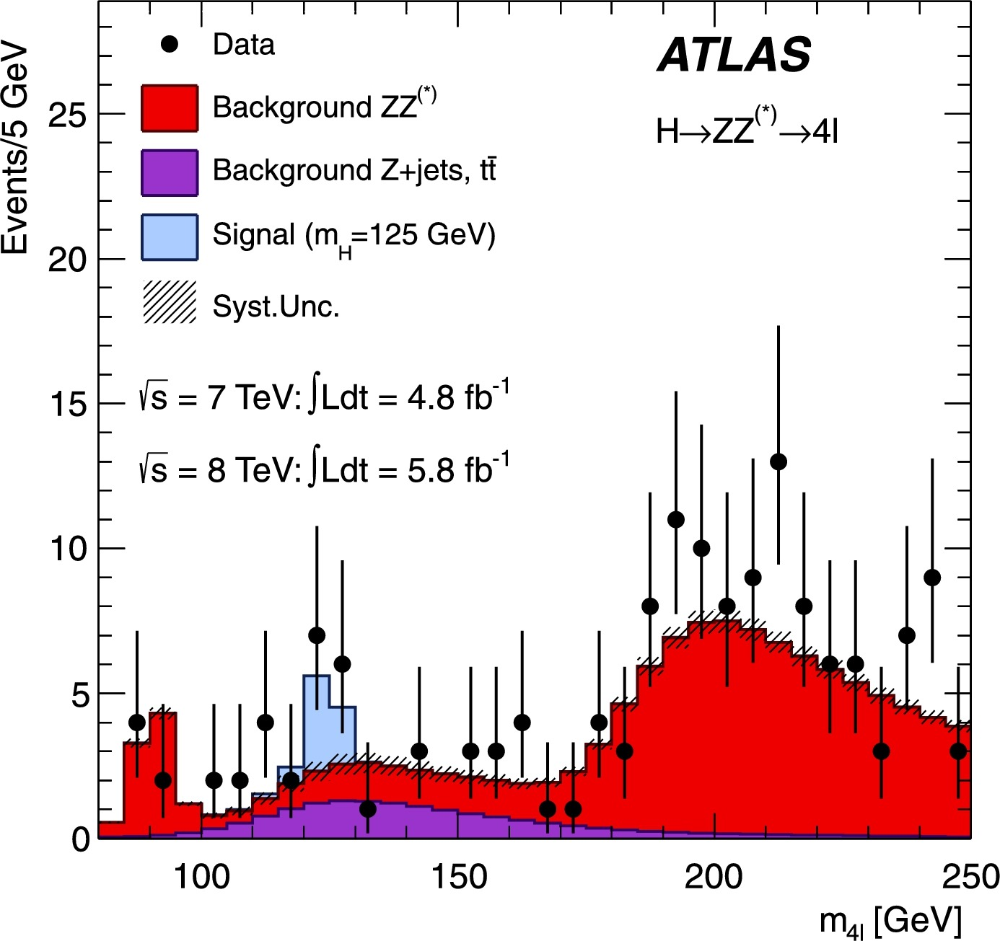

FIXME

plot such as

{:width="40%"}

~~~
def plot_data_vs_MC(data, x_variable='m4l', xmin=80, xmax=250, step_size=5, signal_label=r'Signal ($m_H$ = 125 GeV)', 
                    xlabel=r'$\mathrm{m_{4l}}$', x_units = 'GeV', experiment_label='ATLAS', 
                    process_label=r'$H \rightarrow ZZ^* \rightarrow 4\ell$', cme='13 TeV', lumi='10 fb', mc_weight='totalWeight'):

    bin_edges = np.arange(start=xmin, # The interval includes this value
                          stop=xmax+step_size, # The interval doesn't include this value
                          step=step_size ) # Spacing between values
    bin_centres = np.arange(start=xmin+step_size/2, # The interval includes this value
                            stop=xmax+step_size/2, # The interval doesn't include this value
                            step=step_size ) # Spacing between values

    data_x,_ = np.histogram(data['data'][x_variable], bins=bin_edges ) # histogram the data
    data_x_errors = np.sqrt( data_x ) # statistical error on the data

    signal_x = data[signal_label][x_variable] # histogram the signal
    signal_weights = data[signal_label][mc_weight] # get the weights of the signal events
    signal_color = samples[signal_label]['color'] # get the colour for the signal bar

    mc_x = [] # define list to hold the Monte Carlo histogram entries
    mc_weights = [] # define list to hold the Monte Carlo weights
    mc_colors = [] # define list to hold the colors of the Monte Carlo bars
    mc_labels = [] # define list to hold the legend labels of the Monte Carlo bars

    mc_stat_err_squared = np.zeros(len(bin_centres)) # define array to hold the MC statistical uncertainties
    for s in samples: # loop over samples
        if s not in ['data', signal_label]: # if not data nor signal
            mc_x.append( data[s][x_variable] ) # append to the list of Monte Carlo histogram entries
            mc_weights.append( data[s][mc_weight] ) # append to the list of Monte Carlo weights
            mc_colors.append( samples[s]['color'] ) # append to the list of Monte Carlo bar colors
            mc_labels.append( s ) # append to the list of Monte Carlo legend labels
            weights_squared,_ = np.histogram(data[s][x_variable], bins=bin_edges,
                                             weights=data[s][mc_weight]**2) # square the totalWeights
            mc_stat_err_squared = np.add(mc_stat_err_squared,weights_squared) # add weights_squared for s 
    

    # *************
    # Main plot 
    # *************
    main_axes = plt.gca() # get current axes
    
    # plot the data points
    plt.errorbar(x=bin_centres, y=data_x, yerr=data_x_errors,
                 fmt='ko', # 'k' means black and 'o' is for circles 
                 label='Data') 
    
    # plot the Monte Carlo bars
    mc_heights = plt.hist(mc_x, bins=bin_edges, 
                          weights=mc_weights, stacked=True, 
                          color=mc_colors, label=mc_labels )
    
    mc_x_tot = mc_heights[0][-1] # stacked background MC y-axis value
    mc_x_err = np.sqrt( mc_stat_err_squared ) # statistical error on the MC bars
    
    # plot the signal bar
    plt.hist(signal_x, bins=bin_edges, bottom=mc_x_tot, 
             weights=signal_weights, color=signal_color,
             label=signal_label)
    
    # plot the statistical uncertainty
    plt.bar(bin_centres, # x
            2*mc_x_err, # heights
            alpha=0.5, # half transparency
            bottom=mc_x_tot-mc_x_err, color='none', 
            hatch="////", width=step_size, label='Stat. Unc.' )

    # set the x-limit of the main axes
    plt.xlim( left=xmin, right=xmax ) 
    
    # separation of x axis minor ticks
    main_axes.xaxis.set_minor_locator( AutoMinorLocator() ) 
    
    # set the axis tick parameters for the main axes
    plt.tick_params(which='both', # ticks on both x and y axes
                    direction='in', # Put ticks inside and outside the axes
                    top=True, # draw ticks on the top axis
                    right=True ) # draw ticks on right axis
    
    # x-axis label
    plt.xlabel(xlabel+' ['+x_units+']',
                         x=1, horizontalalignment='right' )
    
    # write y-axis label for main axes
    plt.ylabel('Events / '+str(step_size)+' '+x_units,
                         y=1, horizontalalignment='right') 
    
    # set y-axis limits for main axes
    plt.ylim( bottom=0, top=np.amax(data_x)*1.6 )
    
    # add minor ticks on y-axis for main axes
    main_axes.yaxis.set_minor_locator( AutoMinorLocator() ) 

    # Add text 'ATLAS Open Data' on plot
    plt.text(0.05, # x
             0.93, # y
             experiment_label, # text
             transform=main_axes.transAxes, # coordinate system used is that of main_axes
             weight='bold',
             fontsize=13 ) 
    
    # Add a label for the analysis carried out
    plt.text(0.05, # x
             0.88, # y
             process_label, # text 
             transform=main_axes.transAxes ) # coordinate system used is that of main_axes
    
    # Add energy and luminosity
    plt.text(0.05, # x
             0.82, # y
             '$\sqrt{s}$='+cme+': $\int$Ldt = '+lumi+'$^{-1}$', # text
             transform=main_axes.transAxes ) # coordinate system used is that of main_axes

    # draw the legend
    plt.legend( frameon=False ) # no box around the legend
~~~
{: .language-python}



