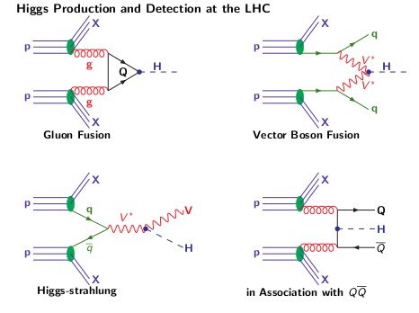
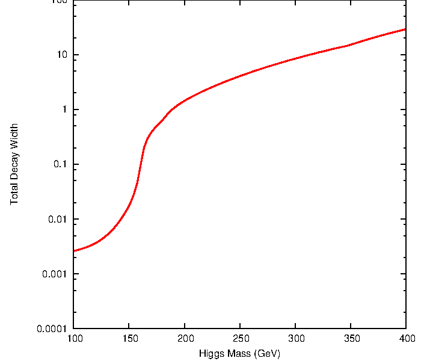
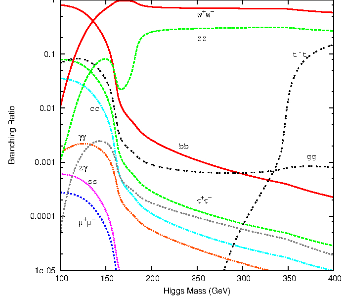
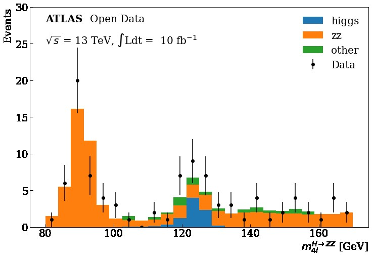
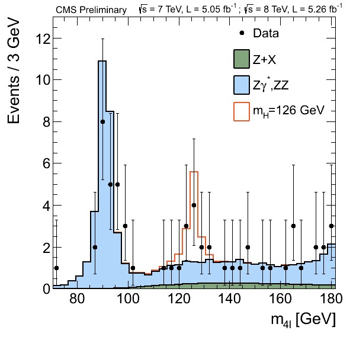
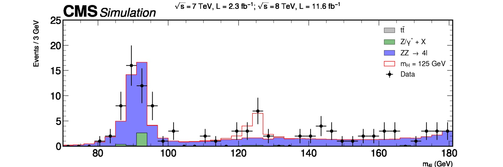

<!-- Mathjax Support -->

You can take a look at the mathematical structure of the Standard Model of Particle Physics in the next section, or go directly to the main Higgs production mechanisms at hadron colliders.

> {: .solution}
>> {: .callout}
>>
>> ## The Standard Model of Particle Physics
>> ### The Standard Model Lagrangian
>>
>> The SM is a quantum field theory that is based on the gauge symmetry $$SU(3)_{C}\times SU(2)_{L}\times U(1)_{Y}$$.  This gauge group includes the symmetry group of the strong interactions, $$SU(3)_{C}$$, and the symmetry group of the electroweak (EW) interactions, $$SU(2)_{L}\times U(1)_{Y}$$.
>>
>> The strong interaction part, quantum chromodynamics (QCD) is an SU(3) gauge theory described by the lagrangian density
>>
>> $${\cal{L}}_{SU(3)}=-\frac{1}{4}G_{\mu\nu}^{a}G_{a}^{\mu\nu}+\sum_{r}\overline{q}_{r\alpha}iD_{\mu\beta}^{\alpha}\gamma^{\mu}q_{r}^{\beta}$$,
>>
>> where $$G_{\mu\nu}^{a}=\partial_{\mu}G_{\nu}^{a}-\partial_{\nu}G_{\mu}^{a}+g_{s}f^{abc}G_{\mu}^{b}G_{\nu}^{c}$$ is the field strength tensor for the gluon fields $$G_{\mu}^{a}$$, $$a=1,\dots,8$$, and the structure constants $$f^{abc}$$ $$(a,b,c=1,\dots,8)$$ are defined by $$[T^{a},T^{b}]=if^{abc}T_{c}$$.
>>
>> The second term in $${\cal{L}}_{SU(3)}$$ is the gauge covariant derivative for the quarks: $$q_{r}$$ is the $$r^{th}$$ quark flavor, $$\alpha$$,$$\beta=1,2,3$$ are color indices, and
>>
>> $$D_{\mu\beta}^{\alpha}=(D_{\mu})_{\alpha\beta}=\partial_{\mu}\delta_{\alpha\beta}-ig_{s}T_{a\alpha\beta}G_{\mu}^{a}$$.
>>
>> The EW theory is based on the $$SU(2)_{L}\times U(1)_{Y}$$ lagrangian density $${\cal{L}}_{SU(2)\times U(1)}={\cal{L}}_{fermions}+{\cal{L}}_{gauge}+{\cal{L}}_{Scalar}+{\cal{L}}_{Yuk}$$,
>> where
>>
>> $${\cal{L}}_{fermions}=\overline{L}_{i}iD_{\mu}\gamma^{\mu}L_{i}+\overline{e}_{Ri}iD_{\mu}\gamma^{\mu}e_{Ri}+\overline{Q}_{i}iD_{\mu}\gamma^{\mu}Q_{i}+\overline{u}_{Ri}iD_{\mu}\gamma^{\mu}u_{Ri}+\overline{d}_{Ri}iD_{\mu}\gamma^{\mu}d_{Ri}$$,
>>
>> and where $$D_{\mu}=\partial_{\mu}-ig_{2}T_{a}W_{\mu}^{a}-ig_{1}\frac{Y_{q}}{2}B_{\mu}$$.
>>
>> The gauge part is
>>
>> $${\cal{L}}_{gauge}=-\frac{1}{4}W_{\mu\nu}^{a}W_{a}^{\mu\nu}-\frac{1}{4}B_{\mu\nu}B^{\mu\nu}$$,
>>
>> where $$W_{\mu\nu}^{a}=\partial_{\mu}W_{\nu}^{a}-\partial_{\nu}W_{\mu}^{a}+g_{2}\epsilon^{abc}W_{\mu}^{b}W_{\nu}^{c}$$ and $$B_{\mu\nu}=\partial_{\mu}B_{\nu}-\partial_{\nu}B_{\mu}$$ are the field strength tensors for the $$SU(2)$$ and $$U(1)$$ gauge fields, respectively.
>>
>> The scalar part of the lagrangian is
>>
>> $${\cal{L}}_{Scalar}=(D^{\mu}\Phi)^{\dagger}(D_{\mu}\Phi)-V(\Phi^{\dagger}\Phi)$$,
>>
>> where $$V(\Phi^{\dagger}\Phi)=\mu^{2}\Phi^{\dagger}\Phi+\lambda(\Phi^{\dagger}\Phi)^{2}$$.
>>
>> The Yukawa Lagrangian is
>>
>> $${\cal{L}_{Yuk}}=-\lambda_{e}\overline{L}\Phi e_{R}-\lambda_{d}\overline{Q}\Phi d_{R}-\lambda_{u}\overline{Q}\tilde\Phi u_{R}+h.c.$$.
>>
>> ### Spontaneous Symmetry Breaking and Mass Generation: The Higgs Mechanism in the SM
>>
>> Experimentally, the weak bosons are massive. We give mass to the gauge bosons through the Higgs Mechanism:  generate mass terms from the kinetic
energy term of a scalar doublet field $${\Phi}$$ that undergoes spontaneous symmetry breaking.
>>
>> Introduce a complex $$SU(2)$$ doublet of scalar fields
>>
>> $$
>> \Phi =
>> \begin{pmatrix}
>> \phi^{+}\\
>> \phi^{0}
>> \end{pmatrix}, Y_{\Phi}=+1
>> $$,
>>
>> in the scalar lagrangian
>>
>> $$
>> {\cal{L}}_{Scalar}=(D^{\mu}\Phi)^{\dagger}(D_{\mu}\Phi)-V(\Phi^{\dagger}\Phi)
$$,
>>
>> where
>>
>> $$
{D_{\mu}=\partial_{\mu}-ig_{s}T_{a}G_{\mu}^{a}-ig_{2}T_{a}W^{a}_{\mu}-ig_{1}\frac{Y_{q}}{2}B_{\mu}}
$$,
>>
and
>>
>>$$V(\Phi^{\dagger}\Phi)={\mu^{2}}\Phi^{\dagger}\Phi+{\lambda}(\Phi^{\dagger}\Phi)^{2}$$.
>>
>>For $$\mu^{2}<0$$, the neutral component of $$\Phi$$ will develop a vev
>>
>> $$
>> < \Phi >_{0}\equiv <0|\Phi|0>=$$
>> $$\begin{pmatrix}
>> 0\\
>> \frac{\upsilon}{\sqrt{2}}
>> \end{pmatrix}
>> $$,
>>
>> with
>> $$\upsilon=\bigg{(}-\frac{\mu^{2}}{\lambda}\bigg{)}^{1/2}$$.
>>
>> Writing the field $$\Phi$$ in terms of four fields $$\phi_{1,2,3}(x)$$ and $$H(x)$$ at first order and expanding it around the minimum
>>
>> $$
>> \Phi =$$
>> $$\begin{pmatrix}
>> \phi^{+}\\
>> \phi^{0}
>> \end{pmatrix}
>> =$$
>> $$\begin{pmatrix}
>> \phi_{2}+i\phi_{1}\\
>> \frac{1}{2}({\upsilon}+{H})-i\phi_{3}
>> \end{pmatrix} =$$
>> $$exp\bigg{[}\frac{i\phi_{a}(x)\tau^{a}(x)}{\upsilon}\bigg{]}
>> \begin{pmatrix}
>> 0\\
>> \frac{1}{2}(\upsilon+{H(x)})
>> \end{pmatrix}
>> $$.
>>
>> We can rotate away the fields $$\phi_{a}(x)$$ by an $$SU(2)_{L}$$ gauge transformation
>>
>> $$
>> \Phi(x)\rightarrow\Phi'(x)=U(x)\Phi(x)=\frac{1}{\sqrt{2}}$$
>> $$\begin{pmatrix}
>> 0\\
>> {\upsilon} +{H(x)}
>> \end{pmatrix}
>> $$,
>>
>> where
>>
>> $$
>> U(x)=exp\bigg{[}-i\phi_{a}\tau^{a}(x)\bigg{]}
>> $$.
>>
>> This gauge choice, called unitary gauge, is equivalent to absorbing the Goldstone modes $$\phi_{a}(x)$$.
>>
>> Then we can fully expand the term $$(D_{\mu}\Phi)^{2}$$ of the lagrangian $${\cal{L}}_{Scalar}$$:
>>
>> $$
>> |D_{\mu}\Phi|^{2}=\frac{1}{2}(\partial_{\mu}H)^{2}+\frac{1}{8}g_{2}^{2}(\upsilon+H)^{2}|W_{\mu}^{1}+iW_{\mu}^{2}|^{2}+\frac{1}{8}(\upsilon+H)^{2}|g_{2}W_{\mu}^{3}-g_{1}B_{\mu}|^{2}
>> $$.
>>
>> We now define the new fields $$W_{\mu}^{\pm}$$ and $$Z_{\mu}$$ ($$A_{\mu}$$ is the field orthogonal to $$Z_{\mu}$$):
>>
>> $$W^{\pm}=\frac{1}{\sqrt{2}}(W_{\mu}^{1}\mp iW_{\mu}^{2}),Z_{\mu}=\frac{g_{2}W_{\mu}^{3}-g_{1}B_{\mu}}{\sqrt{g_{2}^{2}+g_{1}^{2}}},A_{\mu}=\frac{g_{2}W_{\mu}^{3}+g_{1}B_{\mu}}{\sqrt{g_{2}^{2}+g_{1}^{2}}}$$.
>>
>> We can pick up the terms which are bilinear in the fields $$W^{\pm}$$, $$Z$$, $$A$$:
>>
>> $$M_{W}^{2}{W_{\mu}^{+}W^{-\mu}}+\frac{1}{2}M_{Z}^{2}{Z_{\mu}Z^{\mu}}+\frac{1}{2}M_{A}^{2}{A_{\mu}A^{\mu}}$$.
>>
>> The $$W$$ and $$Z$$ bosons have acquired masses, while the photon remains massless
>>
>> $$
>> M_{W}=\frac{1}{2}\upsilon g_{2}, M_{Z}=\frac{1}{2}\upsilon\sqrt{g_{2}^{2}+g_{1}^{2}}, M_{A}=0
>> $$.
>>
>> ### Fermion Masses
>>
>> We can use the same scalar field $$\Phi$$ to generate the fermion masses, with $$Y=+1$$, and the isodoublet $$\tilde\Phi=i\tau_{2}\Phi^{\star}$$, with $$Y=-1$$.  For any fermion generation, we introduce the $$SU(2)_{L}\times U(1)_{Y}$$ invariant Yukawa lagrangian
>>
>> $$
>> {\cal{L}}_{Yuk}=-\lambda_{e}\overline{L}\Phi e_{R}-\lambda_{d}\overline{Q}\Phi d_{R}-\lambda_{u}\overline{Q}\tilde\Phi u_{R}+h.c.
>> $$,
>>
>> and repeat the same procedure as above.  Taking for instance only the electron, we get
>>
>> $$
>> {\cal{L}}_{Yuk}=-\frac{1}{\sqrt{2}}
>> \begin{pmatrix}
>> \overline{\nu}_{e} & \overline{e}_{L}
>> \end{pmatrix}
>> \begin{pmatrix}
>> 0\\
>> \upsilon+H
>> \end{pmatrix}e_{R}+...
>> =-\frac{1}{\sqrt{2}}\lambda_{e}(\upsilon+H)\overline{e}_{L}e_{R}+...
>> $$.
>>
>> The constant term in front of $$\overline{f}_{L}f_{R}$$ (and h.c.) is identified with the fermion mass
>>
>> $$
>> m_{e}=\frac{\lambda_{e}\upsilon}{\sqrt{2}},m_{u}=\frac{\lambda_{u}\upsilon}{\sqrt{2}},m_{d}=\frac{\lambda_{d}\upsilon}{\sqrt{2}}
>> $$.
>>
>> ### The Higgs Particle in the SM
>>
>> The kinetic part of the Higgs field, $$\frac{1}{2}(\partial_{\mu}{H})^{2}$$, comes from the term involving the covariant derivative $$(D_{\mu}\Phi)^{2}$$, while the mass and self-interaction parts, come from the scalar potential
>>
>> $$
>> V(\Phi)={\mu^{2}}\Phi^{\dagger}\Phi+{\lambda}(\Phi^{\dagger}\Phi)^{2}$$
>> $$=\frac{\mu^{2}}{2}
>> \begin{pmatrix}
>> 0 & \upsilon+H
>> \end{pmatrix}
>> \begin{pmatrix}
>> 0\\
>> \upsilon+H
>> \end{pmatrix}
>> +\frac{\lambda}{4}\bigg{|}
>> \begin{pmatrix}
>> 0 & \upsilon+H
>> \end{pmatrix}$$
>> $$\begin{pmatrix}
>> 0\\
>> \upsilon+H
>> \end{pmatrix}
>> \bigg{|}^{2}
>> $$.
>>
>> Using the relation $$\upsilon^{2}=-\mu^{2}/\lambda$$, we get
>>
>> $$
>> V=-\frac{1}{2}\lambda{\upsilon^{2}}(\upsilon+H)^{2}+\frac{1}{4}\lambda(\upsilon+H)^{4}
>> $$.
>>
>> The lagrangian containing the Higgs field H is given by
>>
>> $$
>> {\cal{L}}_{H}=\frac{1}{2}(\partial_{\mu}{H})(\partial^{\mu}{H})-V$$,
>>
>> $${\cal{L}}_{H}=\frac{1}{2}(\partial^{\mu}{H})^{2}-\lambda{\upsilon^{2}}{H^{2}}-\lambda\upsilon {H^{3}}-\frac{\lambda}{4}{H^{4}}
$$.
>>
>> From this Lagrangian, we have that the Higgs boson mass is given by
>>
>> $$
>> m_{H}^{2}=2\lambda{\upsilon^{2}}=-2\mu^{2}
>> $$,
>>
>> and the Feynman rules for the Higgs self-interaction vertices are given by
>>
>> $$
>> g_{HHH}=(3!)i\lambda\upsilon=3i\frac{m_{H}^{2}}{\upsilon}, g_{HHHH}=(4!)i\frac{\lambda}{4}=3i\frac{m_{H}^{2}}{\upsilon^{2}}
>> $$.
>>
>> As for the Higgs boson couplings to gauge bosons and fermions
>>
>> $$
>> {\cal{L}}_{M_{V}}\sim M_{V}^{2}\bigg{(}1+\frac{H}{\upsilon}\bigg{)}^{2}$$,
>>
>>$$
>> {\cal{L}}_{m_{f}}\sim -m_{f}\bigg{(}1+\frac{H}{\upsilon}\bigg{)}
$$,
>>
>> we get
>>
>> $$
>> g_{Hff}=i\frac{m_{f}}{\upsilon}, g_{HVV}=-2i\frac{M_{V}^{2}}{\upsilon}, g_{HHVV}=-2i\frac{M_{V}^{2}}{\upsilon^{2}}
>> $$.
>>

## Higgs Production Mechanisms at Hadron Colliders

The four main Higgs production mechanisms at a hadron collider are

{:width="40%"}

The Higgs boson can decay into fermions and bosons, the total decay width and the branching ratios in function of the Higgs mass are shown below

{:width="50%"}
{:width="50%"}

## Higgs boson decay into four leptons

We are going to focus on the data obtained at the ATLAS and CMS detectors at the LHC for the Vector Boson Fusion production mechanism and its subsequent decay into four leptons in order to get this plot using Matplotlib

{:width="40%"}
{:width="40%"}
{:width="80%"}

<!--- The following sections describe the relevant physics processes of the analysis.

## Signal process

The physical process of interest, also often called signal, is the production of the Higgs boson. The main production modes of the Higgs boson are the gluon fusion and the vector boson fusion production indicated in the plots with the labels gg→H and qq→H, respectively. See below the two Feynman diagrams that describe the processes at leading order.

  

    

  

  

    

  

--->

<!---
## Background processes

Besides the Higgs boson, many other processes can produce very similar signatures in the detector, which have to be taken into account to draw any conclusions from the data.
--->


