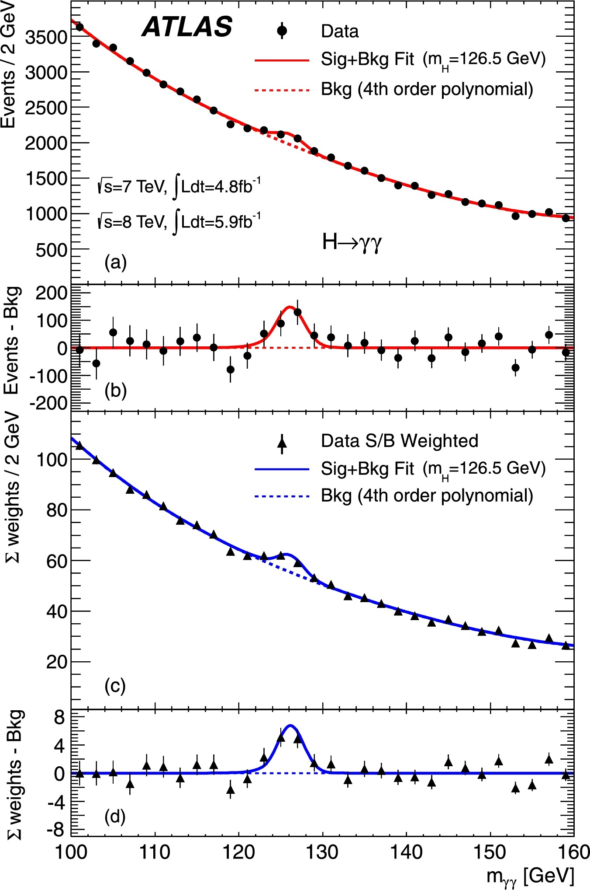

FIXME

plot such as

{:width="40%"}

from [the ATLAS Higgs discovery paper](https://www.sciencedirect.com/science/article/pii/S037026931200857X#fg0040)

Using your version of the 'Matplotlib Data fit' notebook you created in the [Setup page](https://hsf-training.github.io/hsf-training-matplotlib/setup.html)

~~~
plt.hist(all_data['myy'])
~~~
{: .language-python}

What you learnt in school that you should always have axes labels applies here!

~~~
plt.hist(all_data['myy'])
plt.ylabel('Events')
plt.xlabel('myy [GeV]')
~~~
{: .language-python}

If you look back at the graph we're aiming to reproduce, the x-axes are very different. Let's set the x-axis in our graph. In the graph from we're aiming to reproduce, the x-axis starts at 100, ends at 160 and there's a spacing of 2 between each data point. Notice how this code creates an array of values starting at 100 and ending at 160, separated by 2.

~~~
np.arange(start=100, # The interval includes this value
          stop=160+2, # The interval doesn't include this value
          step=2 ) # Spacing between values
~~~
{: .language-python}

Let's define a variable `bin_edges` to hold that array, then use `bin_edges` in the `bins` option of the `plt.hist` function.

~~~
bin_edges = np.arange(start=100, # The interval includes this value
                      stop=160+2, # The interval doesn't include this value
                      step=2 ) # Spacing between values
plt.hist(all_data['myy'],bins=bin_edges)
plt.ylabel('Events')
plt.xlabel('myy [GeV]')
~~~
{: .language-python}

Looking a bit better... But we still have a histogram, whereas the graph we're trying to reproduce has data points with error bars. Ok let's define a variable to hold the histogrammed content, `data`. Let's also define the `errors`. Instead of `bin_edges`, we define a new variable `bin_centres` to plot the data points at the centre of each bin.

~~~
data,_ = np.histogram(all_data['myy'], bins=bin_edges ) # histogram the data
errors = np.sqrt( data ) # statistical error on the data
bin_centres = np.arange(start=101, # The interval includes this value
                        stop=159+2, # The interval doesn't include this value
                        step=2 ) # Spacing between values
plt.errorbar(x=bin_centres, y=data, yerr=errors)
plt.ylabel('Events')
plt.xlabel('myy [GeV]')
~~~
{: .language-python}

Nice! How can we make the data points black circles?

~~~
plt.errorbar(x=bin_centres, y=data, yerr=errors, 
            fmt='ko') # 'k' means black, 'o' means circles
plt.ylabel('Events')
plt.xlabel('myy [GeV]')
~~~
{: .language-python}

Another thing you might've learnt at school is to always add a legend. We need to add the option `label` to the `plt.errorbar` function and also add a line `plt.legend()` at the end.

~~~
plt.errorbar(x=bin_centres, y=data, yerr=errors, 
            fmt='ko', # 'k' means black, 'o' means circles 
	    label='Data')
plt.ylabel('Events')
plt.xlabel('myy [GeV]')
plt.legend()
~~~
{: .language-python}

Now let's add the line fit. Don't worry about the code that calculates the fit as it's not part of our intended learning outcomes for matplotlib. The important part is the last the 2 lines.
~~~
def func(x, a, b, c, d, e, A, mu, sigma): # define function for polynomial + Gaussian
    return a + b*x + c*x**2+ d*x**3 + e*x**4 + A*np.exp(-0.5*((x-mu)/sigma)**2)

# data fit
popt,_ = curve_fit(func, # function to fit
                   bin_centres, # x
                   data, # y
                   p0=[data.max(),0,0,0,0,91.7,125,2.4], # initial guesses for the fit parameters
                   sigma=errors) # errors on y

a = popt[0] # a of a + b*x + c*x^2 + d*x^3 + e*x^4
b = popt[1] # b of a + b*x + c*x^2 + d*x^3 + e*x^4
c = popt[2] # c of a + b*x + c*x^2 + d*x^3 + e*x^4
d = popt[3] # d of a + b*x + c*x^2 + d*x^3 + e*x^4
e = popt[4] # e of a + b*x + c*x^2 + d*x^3 + e*x^4
A = popt[5] # amplitude of Gaussian
mu = popt[6] # centre of Gaussian
sigma = popt[7] # width of Gaussian
fit = func(bin_centres,a,b,c,d,e,A,mu,sigma) # call func with fitted parameters

# plot the data points
plt.errorbar(x=bin_centres, y=data, yerr=errors, 
            fmt='ko', # 'k' means black, 'o' means circles
            label='Data')
plt.ylabel('Events')
plt.xlabel('myy [GeV]')
plt.legend()

# plot the signal + background fit
plt.plot(bin_centres, # x
         fit) # y
~~~
{: .language-python}

We should add a label to this line fit too! We have to move `plt.legend()` to the end of the code so that it picks up both labels.

~~~
# plot the data points
plt.errorbar(x=bin_centres, y=data, yerr=errors, 
            fmt='ko', # 'k' means black, 'o' means circles
            label='Data')
plt.ylabel('Events')
plt.xlabel('myy [GeV]')

# plot the signal + background fit
plt.plot(bin_centres, # x
         fit, # y
         label='Sig+Bkg Fit (mH=125 GeV)')

plt.legend()
~~~
{: .language-python}

What if red is your favourite colour? Add `'r'` to `plt.plot`.

~~~
# plot the data points
plt.errorbar(x=bin_centres, y=data, yerr=errors, 
            fmt='ko', # 'k' means black, 'o' means circles
            label='Data')
plt.ylabel('Events')
plt.xlabel('myy [GeV]')

# plot the signal + background fit
plt.plot(bin_centres, # x
         fit, # y
         'r',
         label='Sig+Bkg Fit (mH=125 GeV)')

plt.legend()
~~~
{: .language-python}

In the graph we're trying to reproduce, there's also a background fit. The important part is in the last few lines we've added.

~~~
# get the background only part of the fit to data
background = a + b*bin_centres + c*bin_centres**2 + d*bin_centres**3 + e*bin_centres**4

# plot the data points
plt.errorbar(x=bin_centres, y=data, yerr=errors, 
            fmt='ko', # 'k' means black, 'o' means circles
            label='Data')
plt.ylabel('Events')
plt.xlabel('myy [GeV]')

# plot the signal + background fit
plt.plot(bin_centres, # x
         fit, # y
         'r',
         label='Sig+Bkg Fit (mH=125 GeV)')

# plot the background only fit
plt.plot(bin_centres, # x
         background) # y 

plt.legend()
~~~
{: .language-python}

Remember: label, label, label!

~~~
# plot the data points
plt.errorbar(x=bin_centres, y=data, yerr=errors, 
            fmt='ko', # 'k' means black, 'o' means circles
            label='Data')
plt.ylabel('Events')
plt.xlabel('myy [GeV]')

# plot the signal + background fit
plt.plot(bin_centres, # x
         fit, # y
         'r',
         label='Sig+Bkg Fit (mH=125 GeV)')

# plot the background only fit
plt.plot(bin_centres, # x
         background, # y 
         label='Bkg (4th order polynomial)')

plt.legend()
~~~
{: .language-python}

We want this one to be red too! We make it a dotted line like `'--r'`.

~~~
# plot the data points
plt.errorbar(x=bin_centres, y=data, yerr=errors, 
            fmt='ko', # 'k' means black, 'o' means circles
            label='Data')
plt.ylabel('Events')
plt.xlabel('myy [GeV]')

# plot the signal + background fit
plt.plot(bin_centres, # x
         fit, # y
         'r',
         label='Sig+Bkg Fit (mH=125 GeV)')

# plot the background only fit
plt.plot(bin_centres, # x
         background, # y 
         '--r',
         label='Bkg (4th order polynomial)')

plt.legend()
~~~
{: .language-python}

How's your graph looking now? When we added the x-axis label, some of it should actually have been subscript. Let's do that now.

~~~
# plot the data points
plt.errorbar(x=bin_centres, y=data, yerr=errors, 
            fmt='ko', # 'k' means black, 'o' means circles
            label='Data')
plt.ylabel('Events')
plt.xlabel('$m_{yy}$ [GeV]')

# plot the signal + background fit
plt.plot(bin_centres, # x
         fit, # y
         'r',
         label='Sig+Bkg Fit (mH=125 GeV)')

# plot the background only fit
plt.plot(bin_centres, # x
         background, # y 
         '--r',
         label='Bkg (4th order polynomial)')

plt.legend()
~~~
{: .language-python}

The label for the fit should really have a subscript too.

~~~
# plot the data points
plt.errorbar(x=bin_centres, y=data, yerr=errors, 
            fmt='ko', # 'k' means black, 'o' means circles
            label='Data')
plt.ylabel('Events')
plt.xlabel('$m_{yy}$ [GeV]')

# plot the signal + background fit
plt.plot(bin_centres, # x
         fit, # y
         'r',
         label='Sig+Bkg Fit ($m_{H}$=125 GeV)')

# plot the background only fit
plt.plot(bin_centres, # x
         background, # y 
         '--r',
         label='Bkg (4th order polynomial)')

plt.legend()
~~~
{: .language-python}

and in fact the x-axis label should use the greek letter gamma, rather than the roman letter y. How do we add latex to matplotlib?

~~~
# plot the data points
plt.errorbar(x=bin_centres, y=data, yerr=errors, 
            fmt='ko', # 'k' means black, 'o' means circles
            label='Data')
plt.ylabel('Events')
plt.xlabel('$m_{\gamma\gamma}$ [GeV]')

# plot the signal + background fit
plt.plot(bin_centres, # x
         fit, # y
         'r',
         label='Sig+Bkg Fit ($m_{H}$=125 GeV)')

# plot the background only fit
plt.plot(bin_centres, # x
         background, # y 
         '--r',
         label='Bkg (4th order polynomial)')

plt.legend()
~~~
{: .language-python}

Oh and our y-axis label isn't quite complete compared to the graph we're trying to reproduce. Let's complete it.

~~~
# plot the data points
plt.errorbar(x=bin_centres, y=data, yerr=errors, 
            fmt='ko', # 'k' means black, 'o' means circles
            label='Data')
plt.ylabel('Events / 2 GeV')
plt.xlabel('$m_{\gamma\gamma}$ [GeV]')

# plot the signal + background fit
plt.plot(bin_centres, # x
         fit, # y
         'r',
         label='Sig+Bkg Fit ($m_{H}$=125 GeV)')

# plot the background only fit
plt.plot(bin_centres, # x
         background, # y 
         '--r',
         label='Bkg (4th order polynomial)')

plt.legend()
~~~
{: .language-python}

If you look back at the graph we're aiming to reproduce, the x-axis really cuts off at 100 and 160. How do we do that?

~~~
# plot the data points
plt.errorbar(x=bin_centres, y=data, yerr=errors, 
            fmt='ko', # 'k' means black, 'o' means circles
            label='Data')
plt.ylabel('Events / 2 GeV')
plt.xlabel('$m_{\gamma\gamma}$ [GeV]')

# plot the signal + background fit
plt.plot(bin_centres, # x
         fit, # y
         'r',
         label='Sig+Bkg Fit ($m_{H}$=125 GeV)')

# plot the background only fit
plt.plot(bin_centres, # x
         background, # y 
         '--r',
         label='Bkg (4th order polynomial)')

plt.legend()

# set the x-limit of the axes
plt.xlim( left=100, right=160 )
~~~
{: .language-python}

and what about the y-axis?

~~~
# plot the data points
plt.errorbar(x=bin_centres, y=data, yerr=errors, 
            fmt='ko', # 'k' means black, 'o' means circles
            label='Data')
plt.ylabel('Events / 2 GeV')
plt.xlabel('$m_{\gamma\gamma}$ [GeV]')

# plot the signal + background fit
plt.plot(bin_centres, # x
         fit, # y
         'r',
         label='Sig+Bkg Fit ($m_{H}$=125 GeV)')

# plot the background only fit
plt.plot(bin_centres, # x
         background, # y 
         '--r',
         label='Bkg (4th order polynomial)')

plt.legend()

# set the x-axis limit for the axes
plt.xlim( left=100, right=160 )

# set the y-axis limit for the axes
plt.ylim( bottom=0 )
~~~
{: .language-python}

Now for some text on the graph.

~~~
# plot the data points
plt.errorbar(x=bin_centres, y=data, yerr=errors, 
            fmt='ko', # 'k' means black, 'o' means circles
            label='Data')
plt.ylabel('Events / 2 GeV')
plt.xlabel('$m_{\gamma\gamma}$ [GeV]')

# plot the signal + background fit
plt.plot(bin_centres, # x
         fit, # y
         'r',
         label='Sig+Bkg Fit ($m_{H}$=125 GeV)')

# plot the background only fit
plt.plot(bin_centres, # x
         background, # y 
         '--r',
         label='Bkg (4th order polynomial)')

plt.legend()

# set the x-axis limit for the axes
plt.xlim( left=100, right=160 )

# set the y-axis limit for the axes
plt.ylim( bottom=0 ) 

plt.text(105, # x
         500, # y
         'ATLAS Open Data')
~~~
{: .language-python}

How can we make the text bold?

~~~
# plot the data points
plt.errorbar(x=bin_centres, y=data, yerr=errors, 
            fmt='ko', # 'k' means black, 'o' means circles
            label='Data')
plt.ylabel('Events / 2 GeV')
plt.xlabel('$m_{\gamma\gamma}$ [GeV]')

# plot the signal + background fit
plt.plot(bin_centres, # x
         fit, # y
         'r',
         label='Sig+Bkg Fit ($m_{H}$=125 GeV)')

# plot the background only fit
plt.plot(bin_centres, # x
         background, # y 
         '--r',
         label='Bkg (4th order polynomial)')

plt.legend()

# set the x-axis limit for the axes
plt.xlim( left=100, right=160 )

# set the y-axis limit for the axes
plt.ylim( bottom=0 ) 

plt.text(105, # x
         500, # y
         'ATLAS Open Data',
         weight='bold')
~~~
{: .language-python}

and increase the font size a bit.

~~~
# plot the data points
plt.errorbar(x=bin_centres, y=data, yerr=errors, 
            fmt='ko', # 'k' means black, 'o' means circles
            label='Data')
plt.ylabel('Events / 2 GeV')
plt.xlabel('$m_{\gamma\gamma}$ [GeV]')

# plot the signal + background fit
plt.plot(bin_centres, # x
         fit, # y
         'r',
         label='Sig+Bkg Fit ($m_{H}$=125 GeV)')

# plot the background only fit
plt.plot(bin_centres, # x
         background, # y 
         '--r',
         label='Bkg (4th order polynomial)')

plt.legend()

# set the x-axis limit for the axes
plt.xlim( left=100, right=160 )

# set the y-axis limit for the axes
plt.ylim( bottom=0 ) 

plt.text(105, # x
         500, # y
         'ATLAS Open Data',
         weight='bold',
         fontsize='13')
~~~
{: .language-python}

Now for some more text that includes latex and superscripts and many fancy things!

~~~
# plot the data points
plt.errorbar(x=bin_centres, y=data, yerr=errors, 
            fmt='ko', # 'k' means black, 'o' means circles
            label='Data')
plt.ylabel('Events / 2 GeV')
plt.xlabel('$m_{\gamma\gamma}$ [GeV]')

# plot the signal + background fit
plt.plot(bin_centres, # x
         fit, # y
         'r',
         label='Sig+Bkg Fit ($m_{H}$=125 GeV)')

# plot the background only fit
plt.plot(bin_centres, # x
         background, # y 
         '--r',
         label='Bkg (4th order polynomial)')

plt.legend()

# set the x-axis limit for the axes
plt.xlim( left=100, right=160 )

# set the y-axis limit for the axes
plt.ylim( bottom=0 ) 

plt.text(105, # x
         500, # y
         'ATLAS Open Data',
         weight='bold',
         fontsize='13')

plt.text(105, # x
         100, # y
         '$\sqrt{s}$=13 TeV, $\int$Ldt=0.5fb$^{-1}$')
~~~
{: .language-python}

and some more text... We need to use `r` before a text string to use some latex.

~~~
# plot the data points
plt.errorbar(x=bin_centres, y=data, yerr=errors, 
            fmt='ko', # 'k' means black, 'o' means circles
            label='Data')
plt.ylabel('Events / 2 GeV')
plt.xlabel('$m_{\gamma\gamma}$ [GeV]')

# plot the signal + background fit
plt.plot(bin_centres, # x
         fit, # y
         'r',
         label='Sig+Bkg Fit ($m_{H}$=125 GeV)')

# plot the background only fit
plt.plot(bin_centres, # x
         background, # y 
         '--r',
         label='Bkg (4th order polynomial)')

plt.legend()

# set the x-axis limit for the axes
plt.xlim( left=100, right=160 )

# set the y-axis limit for the axes
plt.ylim( bottom=0 ) 

plt.text(105, # x
         500, # y
         'ATLAS Open Data',
         weight='bold',
         fontsize='13')

plt.text(105, # x
         100, # y
         '$\sqrt{s}$=13 TeV, $\int$Ldt=0.5fb$^{-1}$')

plt.text(135, # x
         100, # y
         r'$H \rightarrow \gamma\gamma$')
~~~
{: .language-python}

Once again let's increase the font size for this last piece of text.

~~~
# plot the data points
plt.errorbar(x=bin_centres, y=data, yerr=errors, 
            fmt='ko', # 'k' means black, 'o' means circles
            label='Data')
plt.ylabel('Events / 2 GeV')
plt.xlabel('$m_{\gamma\gamma}$ [GeV]')

# plot the signal + background fit
plt.plot(bin_centres, # x
         fit, # y
         'r',
         label='Sig+Bkg Fit ($m_{H}$=125 GeV)')

# plot the background only fit
plt.plot(bin_centres, # x
         background, # y 
         '--r',
         label='Bkg (4th order polynomial)')

plt.legend()

# set the x-axis limit for the axes
plt.xlim( left=100, right=160 )

# set the y-axis limit for the axes
plt.ylim( bottom=0 ) 

plt.text(105, # x
         500, # y
         'ATLAS Open Data',
         weight='bold',
         fontsize='13')

plt.text(105, # x
         100, # y
         '$\sqrt{s}$=13 TeV, $\int$Ldt=0.5fb$^{-1}$')

plt.text(135, # x
         100, # y
         r'$H \rightarrow \gamma\gamma$',
         fontsize='13')
~~~
{: .language-python}

You may notice that we have a box around our legend, whereas the graph we're trying to reproduce doesn't. We use the option `frameon=False` inside `plt.legend` to achieve this.

~~~
# plot the data points
plt.errorbar(x=bin_centres, y=data, yerr=errors, 
            fmt='ko', # 'k' means black, 'o' means circles
            label='Data')
plt.ylabel('Events / 2 GeV')
plt.xlabel('$m_{\gamma\gamma}$ [GeV]')

# plot the signal + background fit
plt.plot(bin_centres, # x
         fit, # y
         'r',
         label='Sig+Bkg Fit ($m_{H}$=125 GeV)')

# plot the background only fit
plt.plot(bin_centres, # x
         background, # y 
         '--r',
         label='Bkg (4th order polynomial)')

plt.legend(frameon=False)

# set the x-axis limit for the axes
plt.xlim( left=100, right=160 )

# set the y-axis limit for the axes
plt.ylim( bottom=0 ) 

plt.text(105, # x
         500, # y
         'ATLAS Open Data',
         weight='bold',
         fontsize='13')

plt.text(105, # x
         100, # y
         '$\sqrt{s}$=13 TeV, $\int$Ldt=0.5fb$^{-1}$')

plt.text(135, # x
         100, # y
         r'$H \rightarrow \gamma\gamma$',
         fontsize='13')
~~~
{: .language-python}

We can achieve some extra functionality if we "get the current axes" (gca) at the start of the code.

~~~
main_axes = plt.gca() # get current axes

# plot the data points
plt.errorbar(x=bin_centres, y=data, yerr=errors, 
            fmt='ko', # 'k' means black, 'o' means circles
            label='Data')
plt.ylabel('Events / 2 GeV')
plt.xlabel('$m_{\gamma\gamma}$ [GeV]')

# plot the signal + background fit
plt.plot(bin_centres, # x
         fit, # y
         'r',
         label='Sig+Bkg Fit ($m_{H}$=125 GeV)')

# plot the background only fit
plt.plot(bin_centres, # x
         background, # y 
         '--r',
         label='Bkg (4th order polynomial)')

plt.legend(frameon=False)

# set the x-axis limit for the axes
plt.xlim( left=100, right=160 )

# set the y-axis limit for the axes
plt.ylim( bottom=0 ) 

plt.text(105, # x
         500, # y
         'ATLAS Open Data',
         weight='bold',
         fontsize='13')

plt.text(105, # x
         100, # y
         '$\sqrt{s}$=13 TeV, $\int$Ldt=0.5fb$^{-1}$')

plt.text(135, # x
         100, # y
         r'$H \rightarrow \gamma\gamma$',
         fontsize='13')
~~~
{: .language-python}

~~~
def plot_data_fit(df, # data as a dataframe
                  xmin=100, # x-axis minimum
                  xmax=160, # x-axis maximum
                  step_size=2, # x-axis difference between data points
                  signal_label='Sig+Bkg Fit ($m_H=125$ GeV)', # legend label for signal
                  background_label='Bkg (4th order polynomial)', # legend label for background
                  xlabel=r'$\mathrm{m_{\gamma\gamma}}$', # x-axis label
                  x_units = 'GeV', # x-axis units
                  experiment_label='ATLAS', # experiment label
                  process_label=r'$H \rightarrow \gamma\gamma$', # label for the process 
                  cme='13 TeV', # centre-mass-energy
                  lumi='10 fb' # luminosity (in inverse units)
                 ):   
    
    bin_edges = np.arange(start=xmin, # The interval includes this value
                          stop=xmax+step_size, # The interval doesn't include this value
                          step=step_size ) # Spacing between values
    bin_centres = np.arange(start=xmin+step_size/2, # The interval includes this value
                            stop=xmax+step_size/2, # The interval doesn't include this value
                            step=step_size ) # Spacing between values

    data,_ = np.histogram(df['myy'], bins=bin_edges ) # histogram the data
    errors = np.sqrt( data ) # statistical error on the data

    # data fit
    popt,_ = curve_fit(func, # function to fit
                       bin_centres, # x
                       data, # y
                       p0=[data.max(),0,0,0,0,91.7,125,2.4], # initial guesses for the fit parameters
                       sigma=errors) # errors on y

    # background part of fit
    a = popt[0] # a of a + b*x + c*x^2 + d*x^3 + e*x^4
    b = popt[1] # b of a + b*x + c*x^2 + d*x^3 + e*x^4
    c = popt[2] # c of a + b*x + c*x^2 + d*x^3 + e*x^4
    d = popt[3] # d of a + b*x + c*x^2 + d*x^3 + e*x^4
    e = popt[4] # e of a + b*x + c*x^2 + d*x^3 + e*x^4
    # get the background only part of the fit to data
    background = a + b*bin_centres + c*bin_centres**2 + d*bin_centres**3 + e*bin_centres**4

    A = popt[5] # amplitude of Gaussian
    mu = popt[6] # centre of Gaussian
    sigma = popt[7] # width of Gaussian
    fit = func(bin_centres,a,b,c,d,e,A,mu,sigma) # call func with fitted parameters

    # data fit - background fit = signal fit
    signal = data - background 

    # *************
    # Main plot 
    # *************
    plt.axes([0.1,0.3,0.85,0.65]) # left, bottom, width, height 
    main_axes = plt.gca() # get current axes
    
    # plot the data points
    main_axes.errorbar(x=bin_centres, y=data, yerr=errors, 
                       fmt='ko', # 'k' means black and 'o' means circles
                       label='Data' ) 
    
    # plot the signal + background fit
    main_axes.plot(bin_centres, # x
                   fit, # y
                   '-r', # single red line
                   label=signal_label )
    
    # plot the background only fit
    main_axes.plot(bin_centres, # x
                   background, # y
                   '--r', # dashed red line
                   label=background_label )

    # set the x-limit of the main axes
    main_axes.set_xlim( left=xmin, right=xmax ) 
    
    # separation of x-axis minor ticks
    main_axes.xaxis.set_minor_locator( AutoMinorLocator() ) 
    
    # set the axis tick parameters for the main axes
    main_axes.tick_params(which='both', # ticks on both x and y axes
                          direction='in', # Put ticks inside and outside the axes
                          top=True, # draw ticks on the top axis
                          labelbottom=False, # don't draw tick labels on bottom axis
                          right=True ) # draw ticks on right axis
    
    # write y-axis label for main axes
    main_axes.set_ylabel('Events / '+str(step_size)+' '+x_units, 
                         horizontalalignment='right') 
    
    # set the y-axis limit for the main axes
    main_axes.set_ylim( bottom=0, top=np.amax(data)*1.1 ) 
    
    # set minor ticks on the y-axis of the main axes
    main_axes.yaxis.set_minor_locator( AutoMinorLocator() ) 
    
    # avoid displaying y=0 on the main axes
    main_axes.yaxis.get_major_ticks()[0].set_visible(False) 

    # Add text 'ATLAS Open Data' on plot
    plt.text(0.2, # x
             0.92, # y
             experiment_label, # text
             transform=main_axes.transAxes, # coordinate system used is that of main_axes
             weight='bold',
             fontsize=13 )  
    
    # Add energy and luminosity
    plt.text(0.05, # x
             0.1, # y
             '$\sqrt{s}$='+cme+': $\int$Ldt = '+lumi+'$^{-1}$', # text
             transform=main_axes.transAxes ) # coordinate system used is that of main_axes 
    
    # Add a label for the analysis carried out
    plt.text(0.5, # x
             0.1, # y
             process_label, # text 
             transform=main_axes.transAxes ) # coordinate system used is that of main_axes

    # draw the legend
    main_axes.legend(frameon=False) # no box around the legend

    # *************
    # Data-Bkg plot 
    # *************
    plt.axes([0.1,0.1,0.85,0.2]) # left, bottom, width, height
    sub_axes = plt.gca() # get the current axes
    
    # set the y axis to be symmetric about Data-Background=0
    sub_axes.yaxis.set_major_locator( MaxNLocator(nbins='auto', 
                                                  symmetric=True) )
    
    # plot Data-Background
    sub_axes.errorbar(x=bin_centres, y=signal, yerr=errors,
                      fmt='ko' ) # 'k' means black and 'o' means circles
    
    # draw the fit to data
    sub_axes.plot(bin_centres, # x
                  fit-background, # y
                  '-r' ) # single red line
    
    # draw the background only fit
    sub_axes.plot(bin_centres, # x
                  background-background, # y
                  '--r' )  # dashed red line
    
    # set the x-axis limits on the sub axes
    sub_axes.set_xlim( left=xmin, right=xmax ) 
    
    # separation of x-axis minor ticks
    sub_axes.xaxis.set_minor_locator( AutoMinorLocator() ) 
    
    # x-axis label
    sub_axes.set_xlabel(xlabel+' ['+x_units+']',
                         x=1, horizontalalignment='right' ) 
    
    # set the tick parameters for the sub axes
    sub_axes.tick_params(which='both', # ticks on both x and y axes
                         direction='in', # Put ticks inside and outside the axes
                         top=True, # draw ticks on the top axis
                         right=True ) # draw ticks on right axis 
    
    # separation of y-axis minor ticks
    sub_axes.yaxis.set_minor_locator( AutoMinorLocator() ) 
    
    # y-axis label on the sub axes
    sub_axes.set_ylabel( 'Events-Bkg' ) 

    # Generic features for both plots
    main_axes.yaxis.set_label_coords( -0.09, 1 ) # x,y coordinates of the y-axis label on the main axes
    sub_axes.yaxis.set_label_coords( -0.09, 0.5 ) # x,y coordinates of the y-axis label on the sub axes
~~~
{: .language-python}



