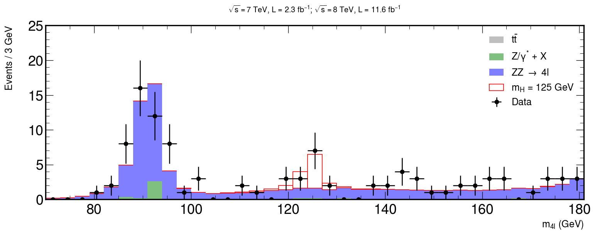
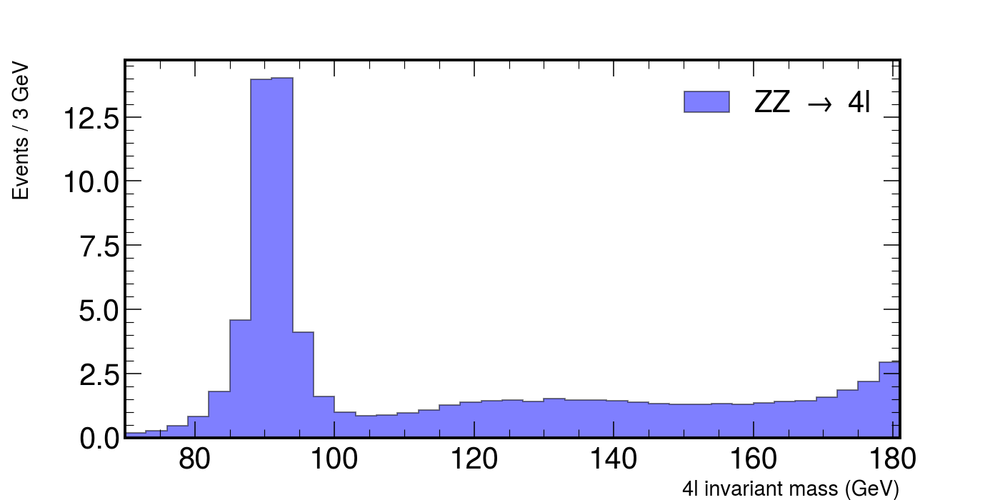
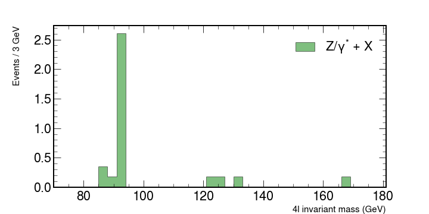
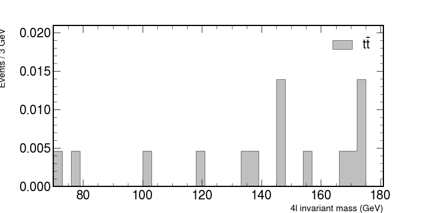
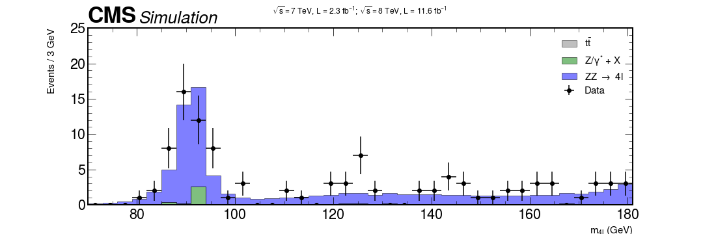
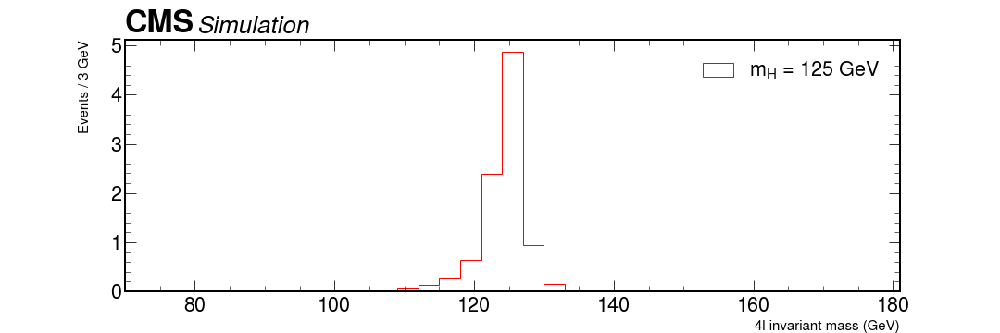
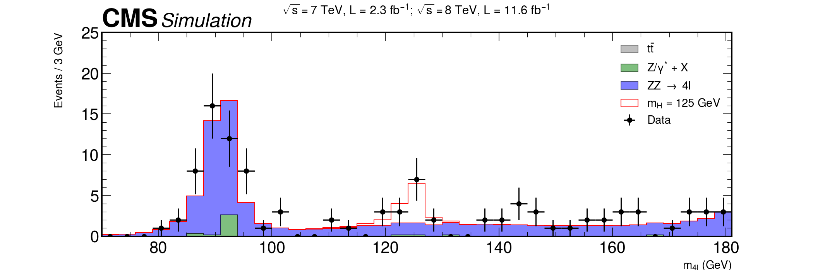

# Introduction

Here we will be using an example from CERN Open Data Portal to reproduce a plot for a Higgs hunt.
All the material is being used directly from this [Google Colab notebook](https://colab.research.google.com/github/GuillermoFidalgo/Python-for-STEM-Teachers-Workshop/blob/master/notebooks/6-Higgs_4leptons.ipynb)

The data we use here are actual, meaningful data from the CMS experiment that confirmed the existence of this elusive particle, which then resulted in a Nobel prize. Instead of hiding somewhere under ready made graphs, it is now yours to explore. The example is based on the original code in [http://opendata.cern.ch/record/5500](http://opendata.cern.ch/record/5500) on the CERN Open Data portal (Jomhari, Nur Zulaiha; Geiser, Achim; Bin Anuar, Afiq Aizuddin; (2017). Higgs-to-four-lepton analysis example using 2011-2012 data. CERN Open Data Portal. DOI:10.7483/OPENDATA.CMS.JKB8.RR42), and worked to a notebook by Tom McCauley (University of Notre Dame) and Peitsa Veteli (Helsinki Institute of Physics).

The method used is pretty common and useful for many purposes. First we have some theoretical background, then we make measurements and try to see if those measurements contain something that correlates or clashes with our assumptions. Perhaps the results confirm our expectations, bring up new questions to look into, force us to adapt our theories or require entirely new ones to explain them. This cycle then continues time and time again.

# Install mplhep and setup

```bash
pip install mplhep
```

```python
import mplhep as hep
import numpy as np
import pandas as pd
import matplotlib.pyplot as plt

hep.style.use("CMS")
# or use any of the following
# {CMS | ATLAS | ALICE | LHCb1 | LHCb2}
```

## Getting the data

Now we will get some data stored in a github repository.

```python
# Data for later use.
file_names = [
    "4e_2011.csv",
    "4mu_2011.csv",
    "2e2mu_2011.csv",
    "4mu_2012.csv",
    "4e_2012.csv",
    "2e2mu_2012.csv",
]
basepath = "https://raw.githubusercontent.com/GuillermoFidalgo/Python-for-STEM-Teachers-Workshop/master/data/"

# here we have merged them into one big list and simultaneously convert it into a pandas dataframe.
csvs = [pd.read_csv(f"{basepath}{file_name}") for file_name in file_names]

fourlep = pd.concat(csvs)
```

In this chapter we will see how to use mplhep commands to make a quality plot.

This is our goal


## Let's begin!

According to the standard model, one of the ways the Higgs boson can decay is by first creating two Z bosons that then decay further into four leptons (electrons, muons...). It isn't the only process with such a final state, of course, so one has to sift through quite a lot of noise to see that happening. The theory doesn't say too much about what the mass of Higgs could be, but some clever assumptions and enlightened guesses can get you pretty far. For an example, four lepton decay is very dominant in some mass regions, which then guides our search.

```python
# Let's set some values here in regards to the region we're looking at.

rmin = 70
rmax = 181
nbins = 37

M_hist = np.histogram(fourlep["M"], bins=nbins, range=(rmin, rmax))
# the tuple `M_hist` that this function gives is so common in python that it is recognized by mplhep plotting functions


hist, bins = M_hist  # hist=frequency ; bins=Mass values
width = bins[1] - bins[0]

center = (bins[:-1] + bins[1:]) / 2
```

Let's look at some simulations from other processes there. Here are some Monte Carlo simulated values for such events that have already been weighted by luminosity, cross-section and number of events. Basically we create a set of values that have some randomness in them, just like a real measurement would have, but which follows the distribution that has been observed in those processes.

Copy and paste these lines to your code


```python
# fmt: off
dy = np.array([0,0,0,0,0,0.354797,0.177398,2.60481,0,0,0,0,0,0,0,0,0,0.177398,0.177398,0,0.177398,0,0,0,0,0,0,0,0,0,0,0,0.177398,0,0,0,0])

ttbar = np.array([0.00465086,0,0.00465086,0,0,0,0,0,0,0,0.00465086,0,0,0,0,0,0.00465086,0,0,0,0,0.00465086,0.00465086,0,0,0.0139526,0,0,0.00465086,0,0,0,0.00465086,0.00465086,0.0139526,0,0])

zz = np.array([0.181215,0.257161,0.44846,0.830071,1.80272,4.57354,13.9677,14.0178,4.10974,1.58934,0.989974,0.839775,0.887188,0.967021,1.07882,1.27942,1.36681,1.4333,1.45141,1.41572,1.51464,1.45026,1.47328,1.42899,1.38757,1.33561,1.3075,1.29831,1.31402,1.30672,1.36442,1.39256,1.43472,1.58321,1.85313,2.19304,2.95083])

hzz = np.array([0.00340992,0.00450225,0.00808944,0.0080008,0.00801578,0.0108945,0.00794274,0.00950757,0.0130648,0.0163568,0.0233832,0.0334813,0.0427229,0.0738129,0.13282,0.256384,0.648352,2.38742,4.87193,0.944299,0.155005,0.0374193,0.0138906,0.00630364,0.00419265,0.00358719,0.00122527,0.000885718,0.000590479,0.000885718,0.000797085,8.86337e-05,0.000501845,8.86337e-05,0.000546162,4.43168e-05,8.86337e-05])
# fmt: on
```

We will look at how these numbers contribute what is measured in the accelerators. Let's look at each individual contribution and then put it all together.

```python
# ZZ, a pair of heavier bosons.

fig, ax = plt.subplots(figsize=(10, 5))
hep.histplot(
    zz,
    bins=bins,
    histtype="fill",
    color="b",
    alpha=0.5,
    edgecolor="black",
    label=r"ZZ $\rightarrow$ 4l",
    ax=ax,
)

ax.set_xlabel("4l invariant mass (GeV)", fontsize=15)
ax.set_ylabel("Events / 3 GeV", fontsize=15)
ax.set_xlim(rmin, rmax)
ax.legend()
fig.show()
```

This would plot the following figure.



> ## Exercise
> Plot each of the backgrounds individually. You should have something similar to
> 
> 
{: .challenge}

### Stacking histograms and adding the CMS logo.

Let's stack them together and see what kind of shape we might expect from the experiment.
To stack histograms together with `hep.histplot` you can pass in a list of the values to be binned like `[ttbar,dy,zz]` and also set the argument `stack=True`.

For the legend you can also pass each corresponding label as a list.
Example:

```python
label = [r"$t\bar{t}$", "Z/$\gamma^{*}$ + X", r"ZZ $\rightarrow$ 4l"]
```

Also use python lists to specify the colors for each plot.

To add the CMS logo you can use the `hep.cms.label()` function. [Look here](https://mplhep.readthedocs.io/en/latest/api.html) for more information on mplhep methods like this one.

### Now add the data

It's customary to use `ax.errorbar` as data is usually shown with uncertainties.
You can define both errors along the x and the y axis as python lists and add them to your data.

Use this for the uncertainties.

```python
xerrs = [width * 0.5 for i in range(0, nbins)]
yerrs = np.sqrt(hist)
```

**Remember** : Google is your friend.

> ## Solution (don't look before trying yourself)
> ```python
>
>xerrs = [width * 0.5 for i in range(0, nbins)]
>yerrs = np.sqrt(hist)
>fig, ax = plt.subplots(figsize=(10, 5))
>hep.histplot(
>    [ttbar, dy, zz],
>    stack=True,
>    bins=bins,
>    histtype="fill",
>    color=["grey", "g", "b"],
>    alpha=0.5,
>    edgecolor="black",
>    label=[r"$t\bar{t}$", "Z/$\gamma^{*}$ + X", r"ZZ $\rightarrow$ 4l"],
>    ax=ax
>)
>
># Measured data
>ax.errorbar(
>    center,
>    hist,
>    xerr=xerrs,
>    yerr=yerrs,
>    linestyle="None",
>    color="black",
>    marker="o",
>    label="Data"
>)
>
>ax.title(
>    "$ \sqrt{s} = 7$ TeV, L = 2.3 $fb^{-1}$; $\sqrt{s} = 8$ TeV, L = 11.6 $fb^{-1}$ \n",
>    fontsize=15,
>)
>ax.set_xlabel("$m_{4l}$ (GeV)", fontsize=15)
>ax.set_ylabel("Events / 3 GeV\n", fontsize=15)
>ax.set_ylim(0, 25)
>ax.set_xlim(rmin, rmax)
>ax.legend(fontsize=15)
>hep.cms.label(rlabel="")
>
>fig.show()
>```
> 
{: .solution}

# Putting it all together

Almost there!

Now it's just a matter of using what we have learned so far to add our signal MC of the Higgs assuming that it has a mass of 125 GeV.

The following code will plot the signal from the montecarlo simulation of our Higgs. Use the same method as before to merge everything together!

```python
# HZZ, our theoretical assumption of a Higgs via two Z bosons.

fig, ax = plt.subplots(figsize=(10, 5))

hep.histplot(
    hzz,
    stack=True,
    bins=bins,
    histtype="fill",
    color="w",
    alpha=1,
    edgecolor="r",
    label="$m_{H}$ = 125 GeV",
    ax=ax,
)
hep.cms.label(rlabel="")
ax.legend()

ax.set_xlabel("4l invariant mass (GeV)", fontsize=15)
ax.set_ylabel("Events / 3 GeV\n", fontsize=15)
ax.set_xlim(rmin, rmax)

fig.show()
```



> ## Bonus question: how can something, that seems to have a mass of roughly 125 GeV decay via two Z bosons, with mass over 90 GeV?
>Add that graph with all background + data and see how it lines up.
{: .challenge}

> ## Solution
>```python
>fig, ax = plt.subplots(figsize=(15, 5))
>
>xerrs = [width * 0.5 for i in range(0, nbins)]
>yerrs = np.sqrt(hist)
>
>hep.histplot(
>    [ttbar, dy, zz, hzz],
>    stack=True,
>    bins=bins,
>    histtype="fill",
>    color=["grey", "g", "b", "w"],
>    alpha=[0.5, 0.5, 0.5, 1],
>    edgecolor=["k", "k", "k", "r"],
>    label=[
>        r"$t\bar{t}$",
>        "Z/$\gamma^{*}$ + X",
>        r"ZZ $\rightarrow$ 4l",
>        "$m_{H}$ = 125 GeV",
>    ],
>    ax=ax
>)
>
>hep.cms.label(rlabel="")
>
># Measured data
>ax.errorbar(
>    center,
>    hist,
>    xerr=xerrs,
>    yerr=yerrs,
>    linestyle="None",
>   color="black",
>    marker="o",
>    label="Data"
>)
>
>ax.title(
>    "$ \sqrt{s} = 7$ TeV, L = 2.3 $fb^{-1}$; $\sqrt{s} = 8$ TeV, L = 11.6 $fb^{-1}$ \n",
>    fontsize=16,
>)
>ax.set_xlabel("$m_{4l}$ (GeV)", fontsize=15)
>ax.set_ylabel("Events / 3 GeV\n", fontsize=15)
>ax.set_ylim(0, 25)
>ax.set_xlim(rmin, rmax)
>ax.legend(fontsize=15)
>
>fig.savefig("final-plot.png", dpi=140)
>fig.show()
>```
{: .solution}



# Done! We are ready to publish :)


