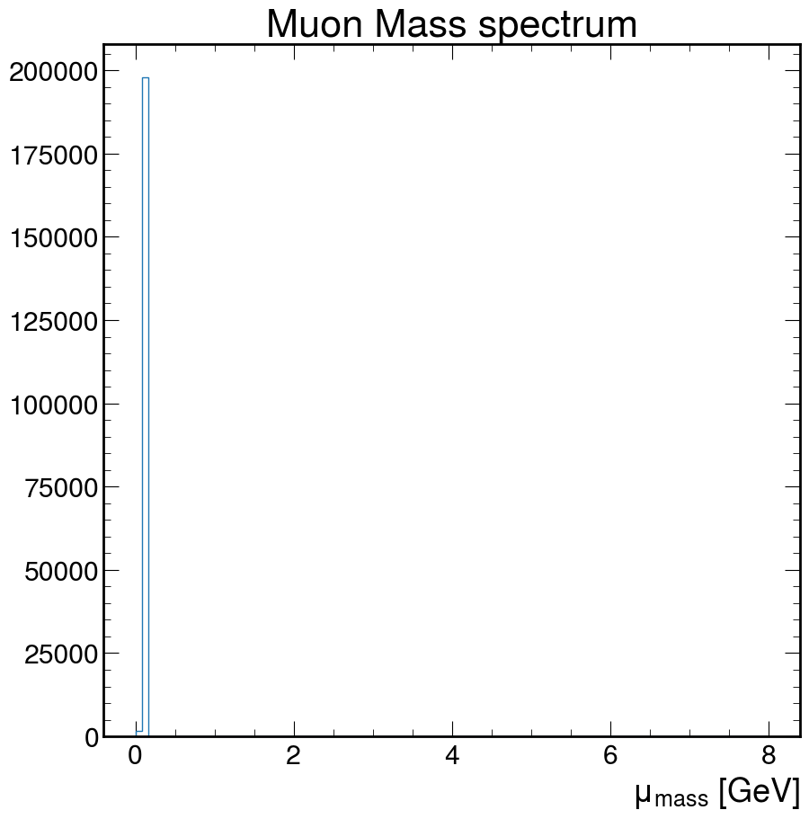
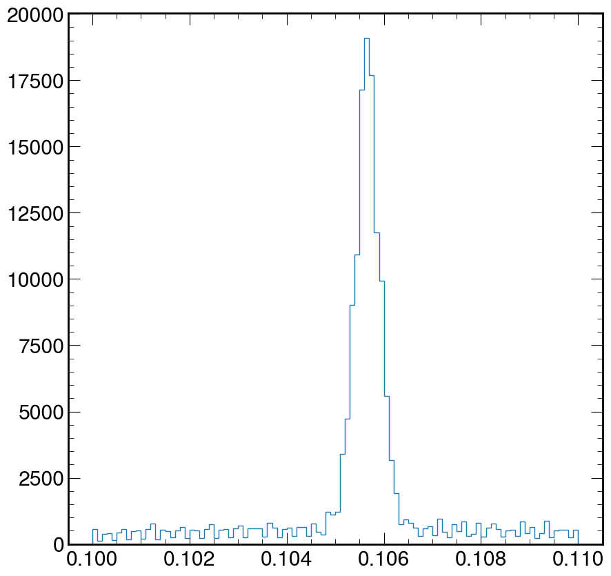
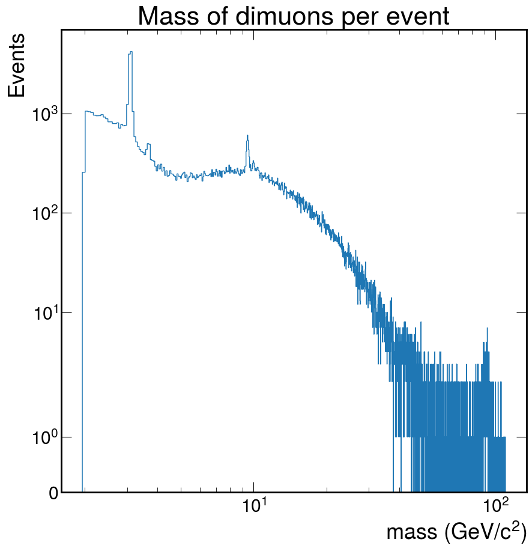

# Introduction

## Looking at the dimuon spectrum over a wide energy range

<!-- Mathjax Support -->
<script type="text/javascript" async
  src="https://cdn.mathjax.org/mathjax/latest/MathJax.js?config=TeX-MML-AM_CHTML">
</script>

<h3>Learning goals</h3>

  - Relativistic kinematics.
  - Mesons.

**Background**

To determine the mass ($$m$$) of a particle you need to know the 4-momenta of the particles ($$\mathbf{P}$$) that are detected after the collision: the energy ($$E$$), the momentum in the x direction ($$p_x$$), the momentum in the y direction ($$p_y$$) and the momentum in the z direction ($$p_z$$).

$$\mathbf{P} = (E,p_x,p_y,p_z)$$

$$
 m = \sqrt{E^2-(p_x^2+p_y^2 + p_z^2)}
$$

Some particles are very unstable and decay (turn into) to two or more other particles. In fact, they can decay so quickly, that they never interact with your detector! Yikes!

However, we can reconstruct the parent particle (sometimes referred to as **the initial state particle**) and its 4-momentum by adding the 4-momenta of the child particles (sometimes referred to as **the decay products**).

$$\mathbf{P_{\rm parent}} = \mathbf{P_{\rm child 0}} + \mathbf{P_{\rm child 1}} + \mathbf{P_{\rm child 2}} + ...$$

which breaks down into...

$$E_{\rm parent} = E_{\rm child 0} + E_{\rm child 1} + E_{\rm child 2} + ...$$

$$p_{\rm x parent} = p_{\rm x child 0} + p_{\rm x child 1} + p_{\rm x child 2} + ...$$

$$p_{\rm y parent} = p_{\rm y child 0} + p_{\rm y child 1} + p_{\rm y child 2} + ...$$

$$p_{\rm z parent} = p_{\rm z child 0} + p_{\rm y child 1} + p_{\rm z child 2} + ...$$

**Let's code!**

Here is some very, very basic starter code. It reads in data from the CMS experiment.

<h2><font color="red">Challenge!</font></h2>

Use the sample code to find the mass of the particle that the two muons came from (parent particle).

To do this, you will need to loop over all pairs of muons for each collision, sum their 4-momenta (energy, px, py, and pz) and then use that to calculate the invariant mass.

Do this for all pairs of muons for the case where the muons have opposite charges.

*Hint!*

It is very likely that a particle exists where there is a peak in the data. However, this is not always true.
A peak in the data is most likely the mass of a particle. You can look at the approximate mass to figure out which particle
is found in the data.

---

<!--
<h2><font color="red">Challenge!</font></h2>

Use the sample code to find the mass of the particle that the two muons came from (parent particle).

To do this, you will need to loop over all pairs of muons for each collision, sum their 4-momenta (energy, px, py, and pz) and then use that to calculate the invariant mass.

Do this for all possible pairs and in addition, break it down so that you calculate the invariant mass for the cases where:
* Both muons are positively charged.
* Both muons are negatively charged.
* The muons have opposite charges.

Be careful. Some collisions may have more than 2 muons, so write your code such that it calculates all possible pairs of muons in a given collisions. For example, if there are 3 muons in a collision, there are 3 possible pairs that you can make.

<i>Hint!</i>

It is very likely that a particle exists where there is a peak in the data. However, this is not always true.
A peak in the data is most likely the mass of a particle. You can look at the approximate mass to figure out which particle
is found in the data. -->

Your histogram should look something like the following sketch. The value of the peaks should be the mass of a particle. You should be able to find two particles in their ground state.<a href="http://en.wikipedia.org/wiki/J/psi_meson"> Check your answer for the first particle!</a> <a href="http://en.wikipedia.org/wiki/Upsilon_meson">Check your answer for the second particle!</a>

```python
from IPython.display import Image

Image(
    url="https://raw.githubusercontent.com/particle-physics-playground/playground/master/activities/images/dimuons_sketch.jpeg"
)
```


```python
import numpy as np
import h5py
import matplotlib.pyplot as plt
import mplhep as hep

plt.style.use("default")
```

Decide which styling you want to use

```python
# This is the default style for matplotlib, do not change this cell if you desire this option
plt.style.use("default")

# This is the mplhep style, uncomment this line for this styling.
# hep.style.use("ROOT")
```

Load the data

```python
#  Make sure you have the correct path to the dimuon file!
event = h5py.File("./data-ep07-dimuonspectrum/dimuon100k.hdf5", mode="r")
```

And now extract it and perform sum

```python
e = event["muons/e"][:]
px = event["muons/px"][:]
py = event["muons/py"][:]
pz = event["muons/pz"][:]

# We will check for muons that do not pass the kinematics
print(len(px))  # Number of muons

# See if there are any anomalies and clean them out
cut = (e**2 - (px**2 + py**2 + pz**2)) < 0

print(sum(cut))  # Count how many anomalies
```

    200000
    343
{: .output}

We can use numpy to clean our arrays from anomalous events

```python
e = np.delete(e, cut)
px, py, pz = np.delete(px, cut), np.delete(py, cut), np.delete(pz, cut)
```

Let's calculate the mass

```python
M = (e**2 - (px**2 + py**2 + pz**2))**.5
```

Make a histogram of the values of the Mass

```python
fig, ax = plt.subplots()
ax.hist(
    M,
    bins=100,
    histtype="step",
)

ax.set_xlabel(r"$\mu_{mass}$ [GeV]")
ax.title("Muon Mass spectrum")
plt.show()
```

{: width="560px"}

Doesn't really look like much. How about we fix that!

## Exercise:

Using the code above, zoom in and fix the above plot to help **visually** estimate the mass of the muon. Where is the value of the peak at?

*Hint:* Google search for the arguments of the `plt.hist` function

> ## Solution
>```python
>fig, ax = plt.subplots()
>ax.hist(M, bins=100, log=False, histtype="step", range=(0.1, 0.11))
>plt.show()
>```
>
>{: width="560px" .image-with-shadow }
{: .solution}
>

# Let's make the dimuon spectrum

We need to calculate the sum the energies at the event level

**REMEMBER**

$$E_{\rm parent} = E_{\rm child 0} + E_{\rm child 1} + E_{\rm child 2} + ...$$

$$p_{\rm x parent} = p_{\rm x child 0} + p_{\rm x child 1} + p_{\rm x child 2} + ...$$

$$p_{\rm y parent} = p_{\rm y child 0} + p_{\rm y child 1} + p_{\rm y child 2} + ...$$

$$p_{\rm z parent} = p_{\rm z child 0} + p_{\rm y child 1} + p_{\rm z child 2} + ...$$

## Calculating the invariant mass of all particles

Let us first implement this with a loop:

```python
def invmass(e, px, py, pz):
    etot, pxtot, pytot, pztot = 0, 0, 0, 0

    # This loops over all of the 4-momentums in the list, and adds together all of their energy,
    # px, py, and pz components
    for i in range(len(e)):
        etot += e[i]
        pxtot += px[i]
        pytot += py[i]
        pztot += pz[i]
        # uses the total energy,px,py,and pz to calculate invariant mass
        m2 = etot**2 - (pxtot**2 + pytot**2 + pztot**2)
    return np.sqrt(abs(m2))
```

However, you might recall that python loops can be a performance issue.
It doesn't matter if you're looping over a few hundred iterations, but if you're looking at millions of events, it's a problem.
Let's use `numpy` to write the same code in a more compact and performant style:

```python
def invmass(e, px, py, pz):
    return np.sqrt(np.abs(e.sum(axis=-1)**2 - (px.sum(axis=-1)**2 + py.sum(axis=-1)**2 + pz.sum(axis=-1)**2)))
```

You might be wondering about the `axis=-1` that we used. This is because it allows our function to both operate on one-dimensional arrays (all particles in an event), or
two-dimensional arrays (all particles in many events, with the first dimension being that of the events).

## Looping over all the muons and checking for the possible charge combinations

First, let's assume that each event only has 2 muons. We will loop over both muons and keep under separate lists those with same charge (\+,\+) or (\-,\-) and those with opposite charge (\+-,\-+).
We can do this with a simple python loop:

```python
# These lists collect the invariant masses
pp = []  # positive positive
nn = []  # negative negative
pm = []  # opposite charges
M = []  # all combinations

for i in range(0, len(q) - 1, 2):  # loop every 2 muons
    # Make a list with information for 2 muons
    E = [e[i], e[i + 1]]
    PX = [px[i], px[i + 1]]
    PY = [py[i], py[i + 1]]
    PZ = [pz[i], pz[i + 1]]
    M.append(invmass(E, PX, PY, PZ))
    if q[i] * q[i + 1] < 0:
        pm.append(invmass(E, PX, PY, PZ))
    elif q[i] + q[i + 1] == 2:
        pp.append(invmass(E, PX, PY, PZ))
    elif q[i] + q[i + 1] == -2:
        nn.append(invmass(E, PX, PY, PZ))
    else:
        print("anomaly?")
print("Done!")

```

Hoewver, again the *proper* way to do this is with numpy. It might be harder to read at first, but once you get used to the syntax, it is actually more transparent:

```python
# Use "reshape" to create pairs of particles
masses = invmass(e.reshape(-1, 2), px.reshape(-1, 2), py.reshape(-1, 2), pz.reshape(-1, 2))

q_pairs = q.reshape(-1, 2)

# Create masks for our selections
pm_mask = q_pairs[:,0]*q_pairs[:,1] < 0
pp_mask = q_pairs[:,0]+q_pairs[:,1] == 2
nn_mask = q_pairs[:,0]+q_pairs[:,1] == -2

anomaly = ~(pm_mask | pp_mask | nn_mask)
if anomaly.any():
    print(f"{anomaly.sum()} anomalies detected")

pp, nn, pm = masses[pp_mask], masses[nn_mask], masses[pm_mask]
```

## Now we plot for all combinations

I would like you to make these 4 histograms *in 4 different ways* focusing on on different mass ranges. To look at these mass ranges, you'll want to use the `bins` and `range` options in the `ax.hist()` function.

- *Mass range 1*: 0 - 120
- *Mass range 2*: 2 - 4
- *Mass range 3*: 8 - 12
- *Mass range 4*: 70 - 120

Remember, you'll have 4 charge combinations for each of these histograms.

1. All charge combinations
2. Only positive muons
3. Only negative muons
4. Only oppositly charged muons

Below I will give you some code to get you started. Please make your changes/additions below this cell and look at each mass range.

```python
# Arguments shared by the .hist calls:
kwargs = dict(
    bins=100,
    histtype="step",
)
fig, ax = plt.subplots(2, 2, figsize=(16, 10))

ax[0][0].hist(M, range=(0, 120), label="All charge combinations", **kwargs)
ax[0][1].hist(pp, range=(0, 120), label="$2+$", **kwargs)
ax[1][0].hist(nn, range=(0, 120), label="$2-$", **kwargs)
ax[1][1].hist(pm, range=(0, 120), label="Electrically neutral", **kwargs)

for irow in range(2):
    for icol in range(2):
        ax[irow][icol].set_xlabel(r"Mass (GeV/c$^2$)", fontsize=14)
        ax[irow][icol].legend(fontsize=18)

plt.tight_layout()
```

## Exercise: Now calculate the mass per event and make the plot.

*Hint!*

You could use the `np.logspace()` function for the binning. It helps in returning numbers spaced evenly on a log scale. You can find out more about it [here](https://numpy.org/doc/stable/reference/generated/numpy.logspace.html).
> ## Solution
>```python
>logbins = np.logspace(0, 2.5, 200)
>fig, ax = plt.subplots()
>ax.hist(pm, bins=logbins, histtype="step")
>ax.set_xlabel("mass (GeV/$c^2$)")
>ax.set_ylabel("Events")
>ax.set_xscale("log")
>ax.set_title("Mass of dimuons per event")
>ax.autoscale()
>
>plt.show()
>```
{: .solution}

{: width="560px"}

Depending on what you did, you may see hints of particles below $$20 GeV/c^2$$. It is possible you see signs of other particles at even higher energies. Plot your masses over a wide range of values, but then zoom in (change the plotting range) on different mass ranges to see if you can identify these particles.

```python
Image(url='https://twiki.cern.ch/twiki/pub/CMSPublic/HLTDiMuon2017and2018/CMS_HLT_DimuonMass_Inclusive_2017.png')
```



